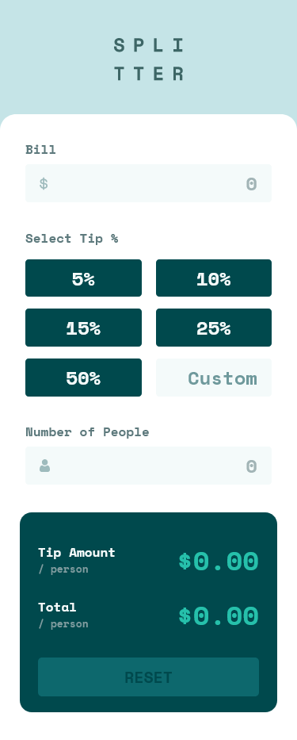
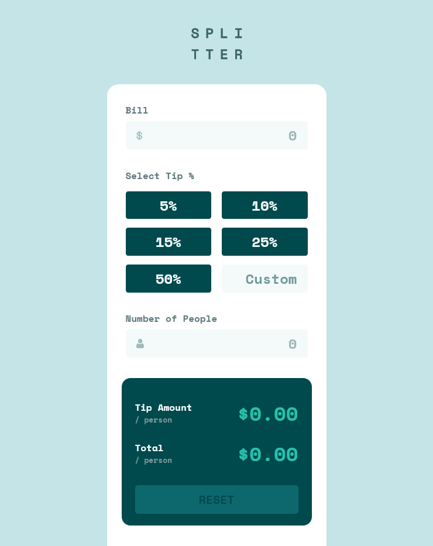
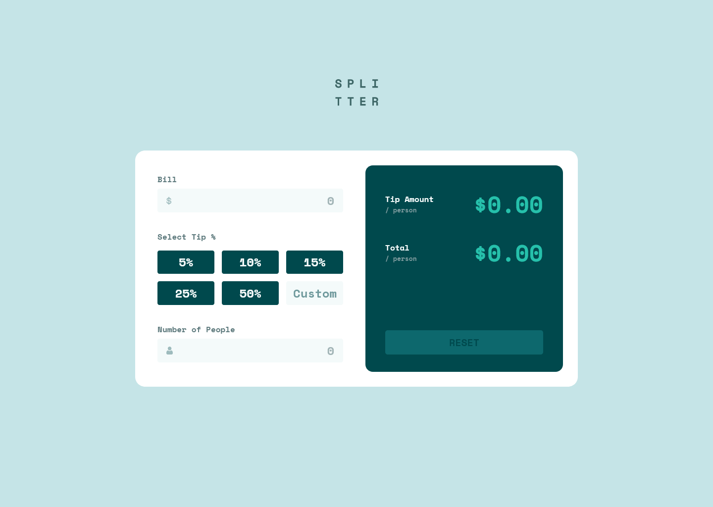

# Frontend Mentor - Tip calculator app solution

This is a solution to the [Tip calculator app challenge on Frontend Mentor](https://www.frontendmentor.io/challenges/tip-calculator-app-ugJNGbJUX). Frontend Mentor challenges help you improve your coding skills by building realistic projects.

## Table of contents

- [Overview](#overview)
  - [The challenge](#the-challenge)
  - [Screenshot](#screenshot)
  - [Links](#links)
- [My process](#my-process)
  - [Built with](#built-with)
- [Author](#author)

## Overview

### The challenge

Users should be able to:

- View the optimal layout for the app depending on their device's screen size
- See hover states for all interactive elements on the page
- Calculate the correct tip and total cost of the bill per person

### Screenshot

#### Result Mobile

#### Result Tablets

#### Result Desktop

### Links

- Solution URL: [Repository Project](https://github.com/Samuel-Amaro/tip-calculator-app)
- Live Site URL: [Live Result](https://samuel-amaro.github.io/tip-calculator-app/)

## My process

### Built with

- Semantic HTML5 markup
- CSS custom properties
- Flexbox
- CSS Grid
- Mobile-first workflow
- Responsive Web Design(RWD)
- Web acessibility
- JavaScript Programming Language
- API DOM JS
- Normalize CSS - [Normalize](https://necolas.github.io/normalize.css/) - Reset CSS
- Methodology BEM(Block Element Modifier) - [BEM](http://getbem.com/introduction/) - Methodology

## Author

- Website - [Portefólio Samuel Amaro](https://samuel-amaro.github.io/portefolio-website/)
- Frontend Mentor - [@Samuel-Amaro](https://www.frontendmentor.io/profile/Samuel-Amaro)

